# Physics validation

## Data validation

The results obtained with DPMJET are compared against data using a custom code called [MCVD](https://github.com/impy-project/MCVD) (currently private). [The latest result is linked here.](figures/193/DPMJET-III-193-validation.pdf)

## DPMJET-III 19.3

DPMJET-III prior 19.3 exhibited sharp multiplicity peaks in kaon and lambda production at very low energies ($\sim20$ GeV). The origin of this feature is rooted in the order of string formation. The string kinematics are known after the selection flavors. For some fraction of cases, strings with very small masses and strange quarks at ends fragment into a kaon (or lambda). If the original string mass is too small, there is insufficient kinetic energy left to distribute the strange hadrons into a larger range of phase space. This manifests into many low-energy kaons or lambda, going to the same rapidity range.

|  | 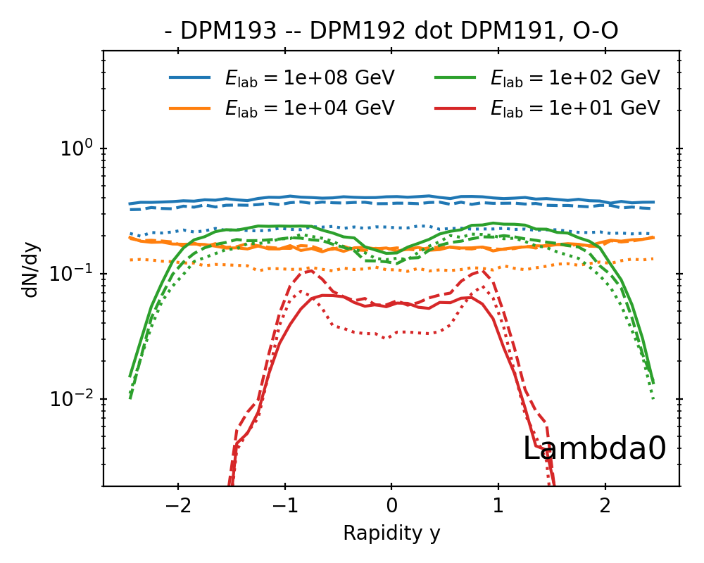 |
| - | - |

The figures for [K+](#K+_rapidity) and [Lambda0](#Lambda0_rapidity) demonstrate clearly this effect at 10 GeV lab. The solid line represents DPMJET-III 19.3, which contains the a suppression of strangeness for low mass strings. This is implemented in the subroutine [DT_GETPTN](../src/dpmjet/DT_GETPTN.f), as a replacement of strange sea quarks with $u$ or $d$ for string masses $M_s < 0.765$ GeV. Since now there are more strings with light quark ends, there is an impact on the multiplicities distributions of other particles. This is shown in the series of figures below.

|  | 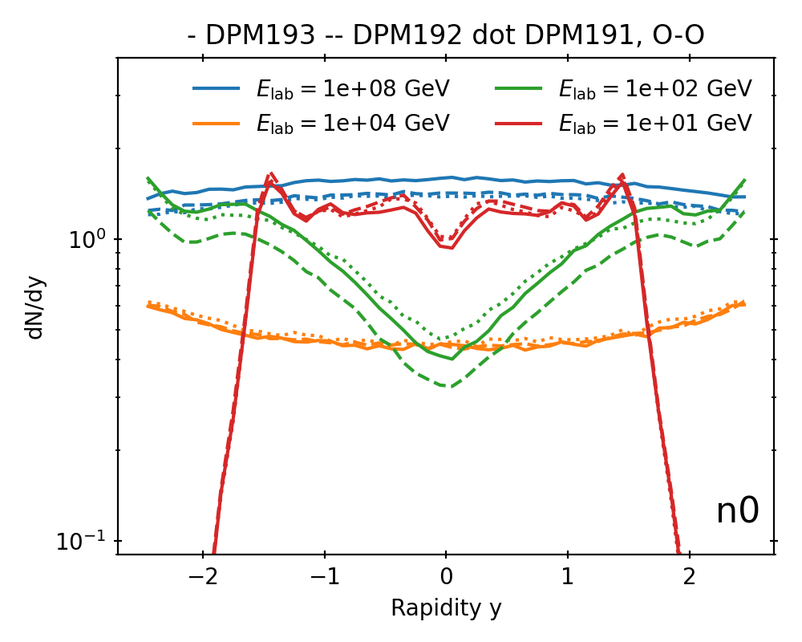
| - | - |

| 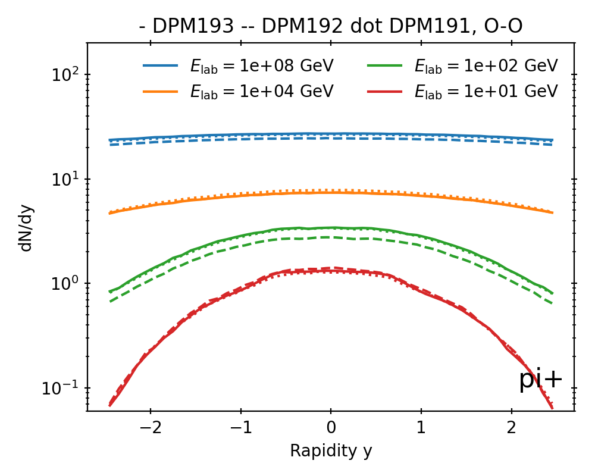 | 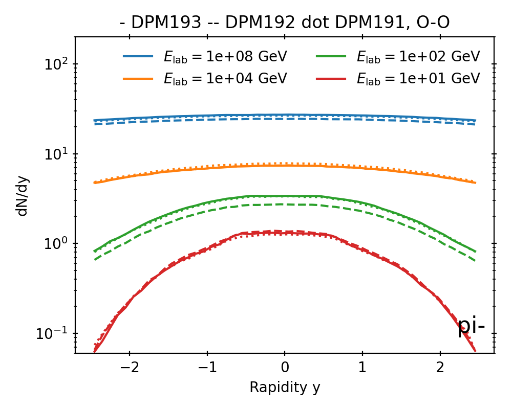 |
| - | - |

| 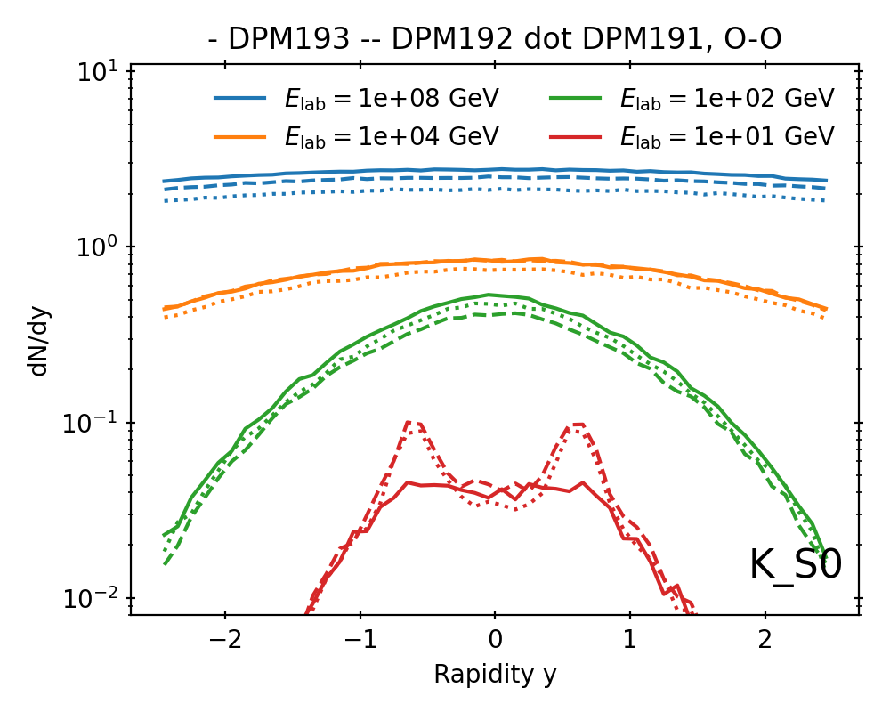 |  |
| - | - |

These changes imply also changes to the total particle multiplicity.

|  | 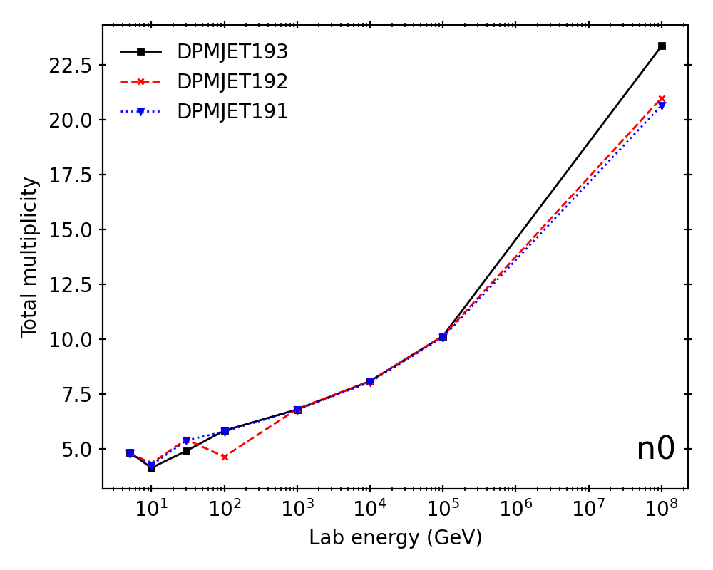
| - | - |

|  | 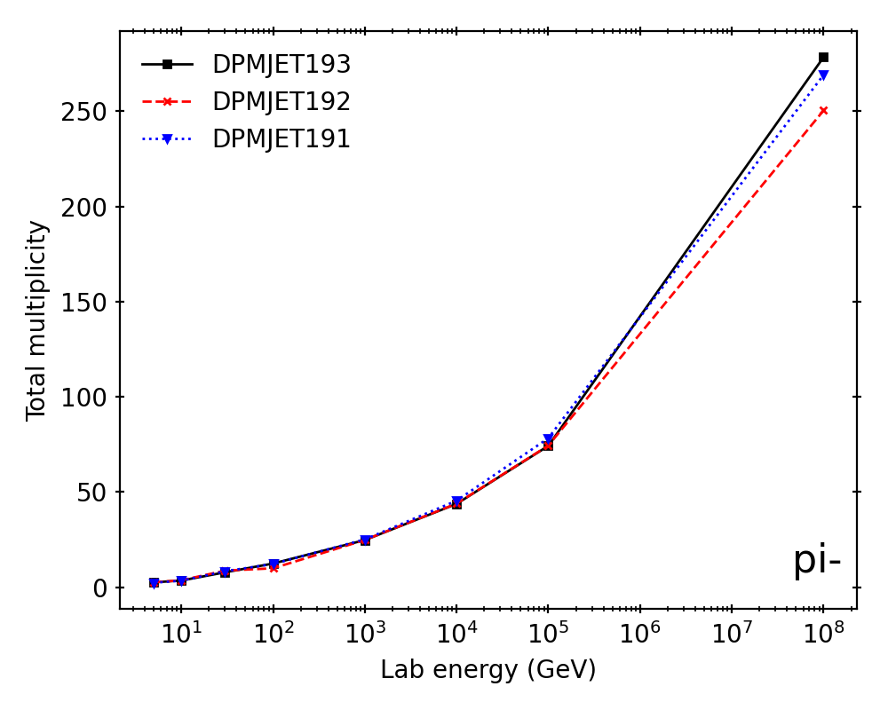 |
| - | - |

| 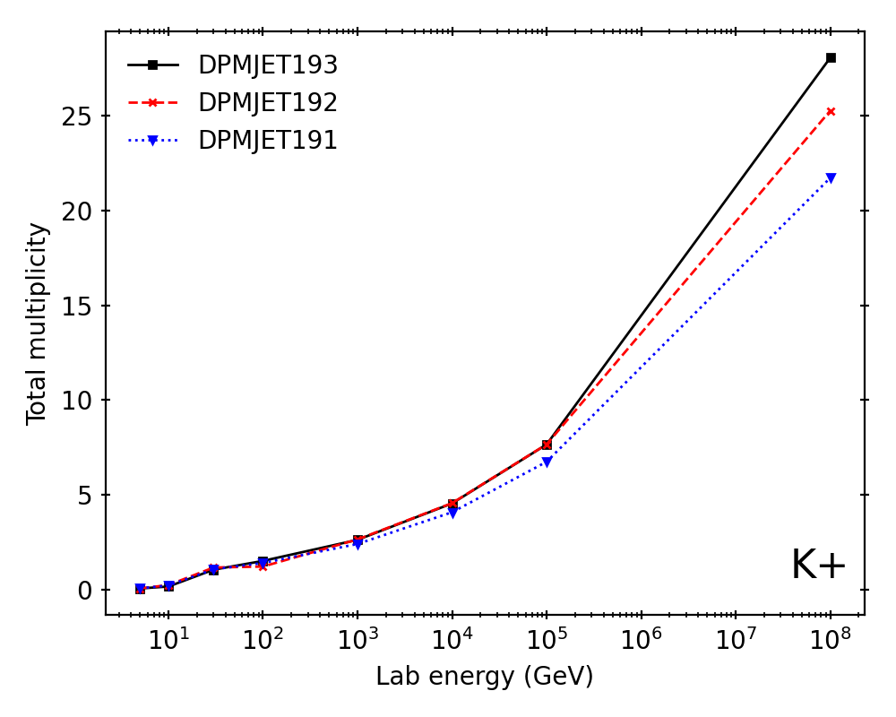 | 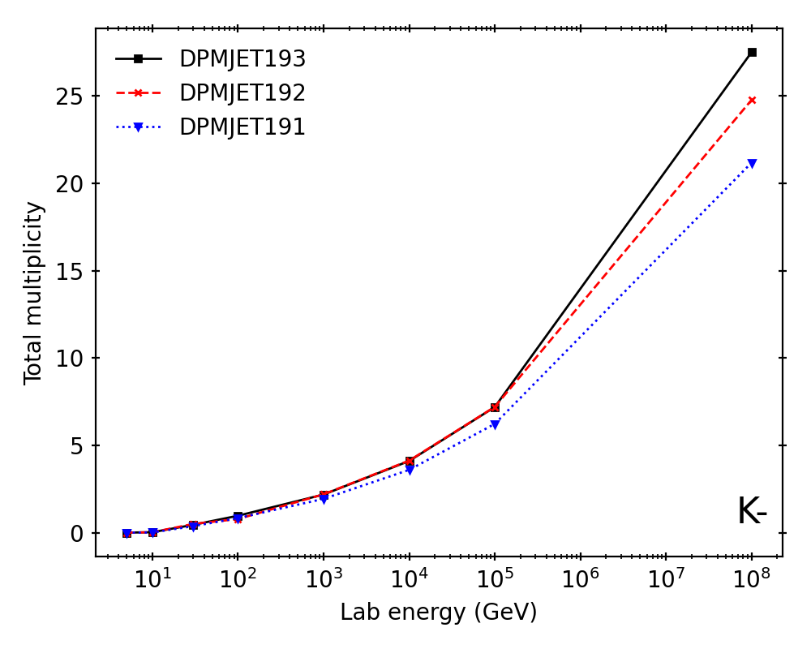 |
| - | - |

| 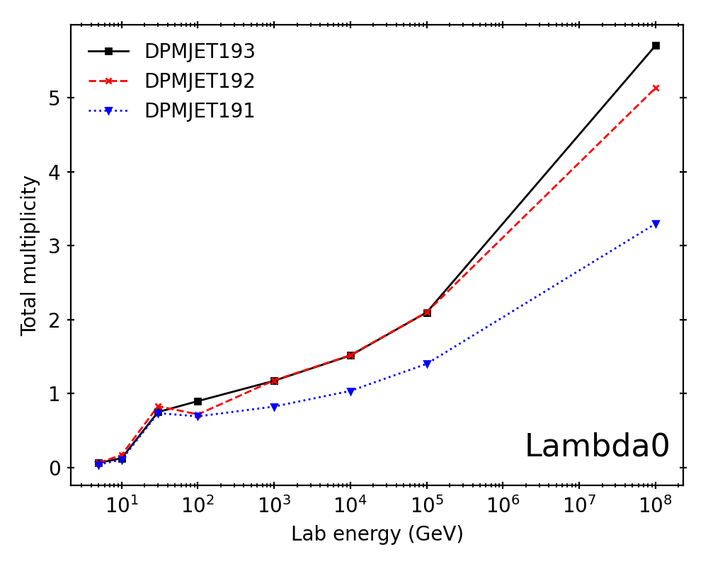 | 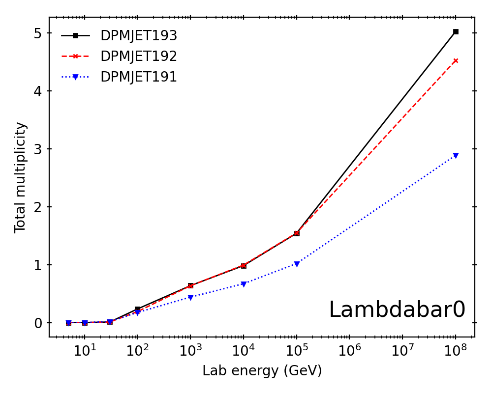
| - | - |

## DPMJET-III 19.2

The version marks a return to an older set of fragmentation parameters on request by CERN FLUKA team. There is no obvious preference by data for either of the parameter sets.
